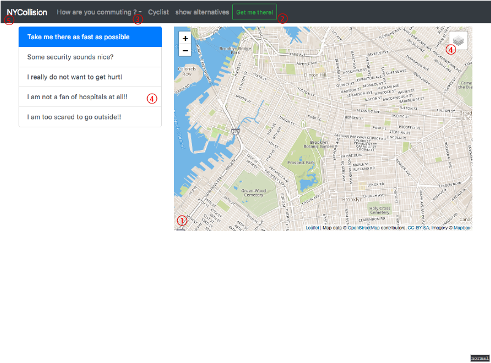

# NYCollision
web-based visualization to show vehicle collision data from NYC

To run this web-based visualization you need git and node/npm on your machine,
as well as some webserver architecture

## Introduction

1. select with panning and zooming any two points in new york city as start and end target of your ride.
2. click the button to get the path visualized with colors mapping to the local maximum of killed pedestrians by default.
3. change to your preferred way of commuting and see how the rate in accidents change. Please bear in mind that you have to set your route again.
4. choose a safety strategy that fits you and we will provide you with the right route. Toggle inside the map the indicator, choose between injured and killed persons.
5. click on the home button to clear the map and start fresh

## install
Get repository from github

    git clone https://github.com/glncstgl/NYCollision

install modules from package.json from root directory of the project

    npm install

run setupdb script to create database tables, user and insert data
please provide the path to the database dump file

    ./setupdb.sh ./data/nyc.dump

## usage
start local server on ./dist directory for example with node to launch the application locally

    npm start server

## dev
start webpack service from the root directory of the project to watch files from ./src

    npm run watch
